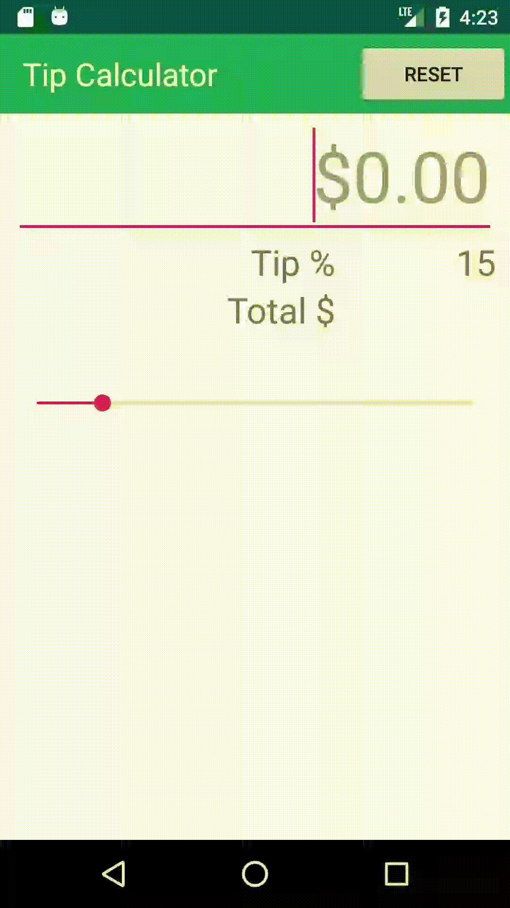
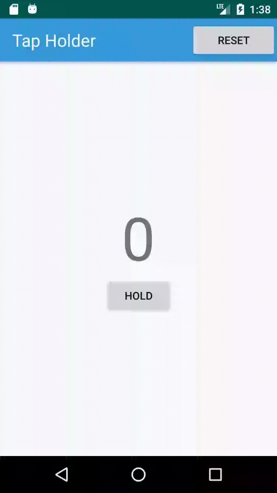
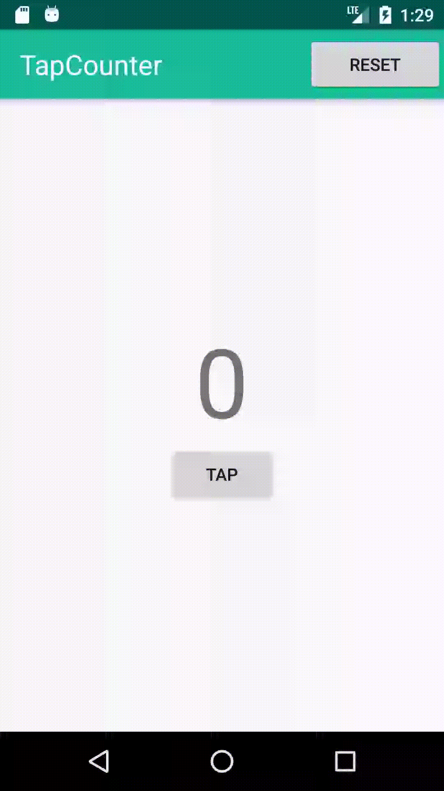

# 100 Days of Android

## 5. Image Picker
*Date: 2020-03-02*

**What I learned from this demo:**

* Start a intent and get the result from that
* Work with local images and camera basics
* Display bitmap data on an ImageView

**Challenge**

## 4. Display My Location in map

*Date: 2020-02-19*

**What I learned from this demo:**

* Work with LocationManager, get GPS providers and locations
* Got to know how to request specified Permissions at RunTime
* Add Markers on the map

**Challenge**

* Add zoom buttons

## 3. Tip Calculator

*Date: 2020-02-14*

**What I learned from this demo:**

* Work with textedit and seekbar
* setOnSeekBarChangeListener
* TextWatcher which runs functions every time user enters a value into edittext

**Challenge**

* Add tax calculator for each province

## 2. Tap Holder

*Date: 2020-02-10*

**What I learned from this demo:**

* CountDownTimer
* setOnTouchListener

**Challenge**

* Add a progress bar

## 1. Tap Counter

*Date: 2020-02-03*

**What I learned from this demo:**

* Use setOnTouchListener
* Add a toolbar

**Challenge**

* Add a reset button inside toolbar